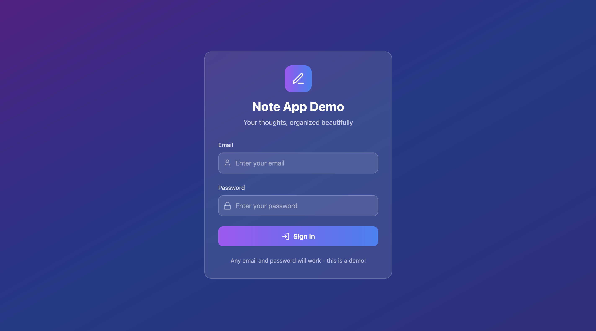
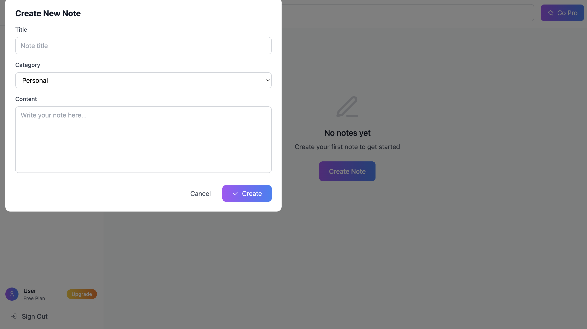

# Note App Demo

A beautiful and modern note-taking application built with React and Tailwind CSS.

## 🚀 Live Demo

**[View Live Demo](https://mutlukurt.github.io/note-taking-app-v2/)**

Experience the app live on GitHub Pages!

## Screenshots

### Login Screen

*Beautiful gradient login screen with glass-morphism effect and modern design*

### Main Dashboard

*Clean and organized note management interface with sidebar navigation*

### Note Creation Modal

*Intuitive note creation and editing interface with form fields*

### Pro Features Modal

*Premium features upgrade interface with pricing plans*

## Features

- ✨ **Beautiful UI**: Modern, responsive design with smooth animations
- 🔐 **Authentication**: Simple login system (demo mode)
- 📝 **Note Management**: Create, edit, and delete notes
- 🏷️ **Categories**: Organize notes with custom categories
- 🔍 **Search**: Find notes quickly with search functionality
- 💾 **Local Storage**: Data persists in your browser
- 📱 **Responsive**: Works on all devices
- ⭐ **Pro Features**: Upgrade modal with premium features

## Getting Started

### Prerequisites

- Node.js (version 14 or higher)
- npm or yarn

### Installation

1. Clone the repository:
```bash
git clone <repository-url>
cd note-app-v2
```

2. Install dependencies:
```bash
npm install
```

3. Start the development server:
```bash
npm start
```

4. Open [http://localhost:3000](http://localhost:3000) in your browser.

## Usage

### Authentication
- Use any email and password to log in (demo mode)
- Click "Sign Out" to log out

### Creating Notes
1. Click "New Note" button in the sidebar
2. Fill in the title, select a category, and write your content
3. Click "Create" to save

### Managing Notes
- **Edit**: Click the edit icon on any note
- **Delete**: Click the trash icon on any note
- **Search**: Use the search bar to find specific notes
- **Filter**: Click on categories to filter notes

### Categories
- **Default**: Personal, Work, Ideas
- **Custom**: Add new categories using the input field
- **Delete**: Remove custom categories (default ones are protected)

## Project Structure

```
note-app-v2/
├── public/
│   └── index.html
├── src/
│   ├── App.js          # Main application component
│   ├── index.js        # Application entry point
│   └── index.css       # Global styles and Tailwind imports
├── package.json         # Dependencies and scripts
├── tailwind.config.js  # Tailwind CSS configuration
└── README.md           # Project documentation
```

## Technologies Used

- **React 18**: Modern React with hooks
- **Tailwind CSS**: Utility-first CSS framework
- **Lucide React**: Beautiful icon library
- **Local Storage**: Browser-based data persistence

## Available Scripts

- `npm start`: Start development server
- `npm build`: Build for production
- `npm test`: Run tests
- `npm eject`: Eject from Create React App

## Customization

### Colors
Modify the color scheme in `tailwind.config.js` under the `extend.colors` section.

### Animations
Add custom animations in `tailwind.config.js` under the `extend.animation` and `extend.keyframes` sections.

### Styling
Custom styles can be added to `src/index.css`.

## Browser Support

- Chrome (latest)
- Firefox (latest)
- Safari (latest)
- Edge (latest)

## Contributing

1. Fork the repository
2. Create a feature branch
3. Make your changes
4. Submit a pull request

## License

This project is open source and available under the [MIT License](LICENSE).

## Demo

This is a demo application showcasing modern web development practices. All data is stored locally in your browser and will be cleared when you clear your browser data.
